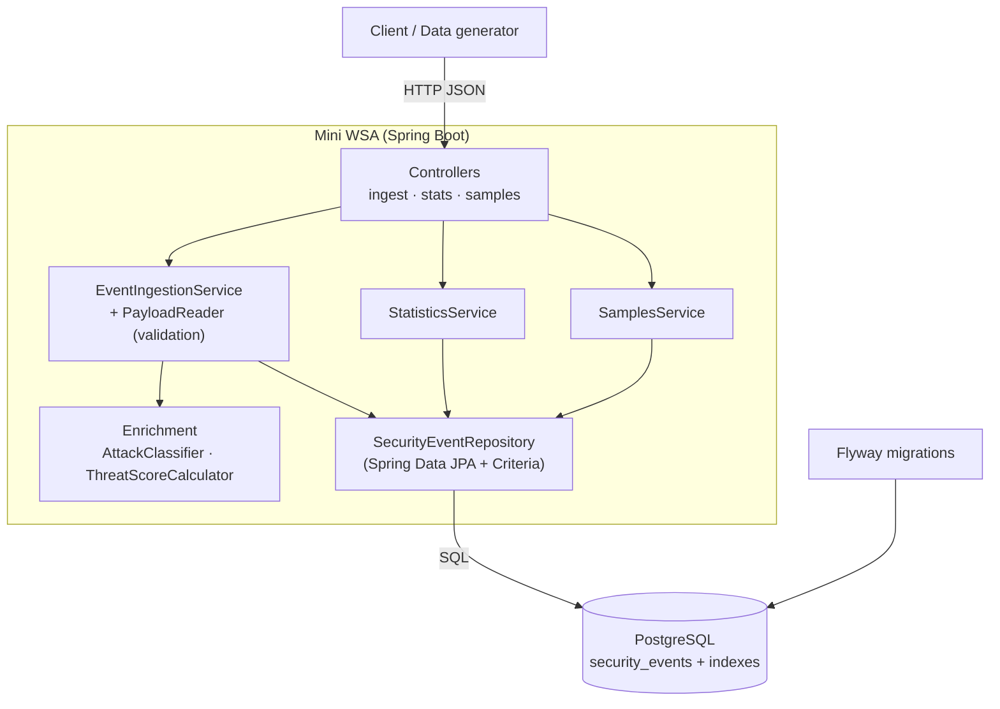

# Mini WSA — Security Analytics Pipeline

A simplified version of a Web Security Analytics (WSA) backend. It ingests security event
records (DLRs), classifies and enriches them, computes a threat score, persists them, and exposes
analytics APIs for aggregated statistics and individual sample retrieval.

Built with **Java 21** and **Spring Boot 4.1**, backed by **PostgreSQL** (with **Flyway** migrations).

---

## Table of contents

- [Quick start](#quick-start)
- [Build & run](#build--run)
- [Generating test data](#generating-test-data)
- [API documentation](#api-documentation)
- [Architecture](#architecture)
- [Storage choice](#storage-choice)
- [Testing](#testing)
- [Design decisions worth calling out](#design-decisions-worth-calling-out)
- [What I would improve with more time](#what-i-would-improve-with-more-time)
- [Challenges and how I solved them](#challenges-and-how-i-solved-them)

---

## Quick start

```bash
# 1. Start PostgreSQL
docker compose up -d

# 2. Build and run the service (listens on http://localhost:8080)
./mvnw spring-boot:run

# 3. Generate sample data and load it
./mvnw -q compile exec:java -Dexec.args="--count 10000 --out generated-events --chunk-size 1000"
for f in generated-events/part-*.json; do
  curl -s -X POST http://localhost:8080/v1/events/ingest \
    -H 'Content-Type: application/json' --data-binary @"$f" \
    -o /dev/null -w "$f -> %{http_code}\n"
done

# 4. Query analytics
curl "http://localhost:8080/v1/stats/summary?from=2020-01-01T00:00:00Z&to=2030-01-01T00:00:00Z"
curl "http://localhost:8080/v1/events/samples?limit=5"
```

---

## Build & run

### Prerequisites

- JDK 21+
- Docker (for PostgreSQL) — or an existing PostgreSQL instance
- No local Maven needed; the project ships the Maven wrapper (`./mvnw`)

### Start PostgreSQL

```bash
docker compose up -d
```

This starts PostgreSQL 17 with database `mini_wsa` and user/password `mini_wsa` / `mini_wsa`,
matching the application defaults. Flyway creates the schema automatically on first startup.

### Run the application

**Option A — with PostgreSQL (default):**

```bash
docker compose up -d          # or point at your own Postgres via env vars below
./mvnw spring-boot:run
```

**Option B — no database install (in-memory H2):**

If you don't have Docker or PostgreSQL, run the `local` profile. It uses an in-memory H2 database
(PostgreSQL compatibility mode) with the same Flyway migration, so the app runs with **only a JDK
installed**. Data is not persisted across restarts.

```bash
./mvnw spring-boot:run -Dspring-boot.run.profiles=local
```

The service starts on `http://localhost:8080`. Verify it is up:

```bash
curl http://localhost:8080/health
# {"status":"UP"}
```

### Configuration

Connection settings can be overridden via environment variables (defaults in parentheses):

| Variable      | Default                                        |
| ------------- | ---------------------------------------------- |
| `DB_URL`      | `jdbc:postgresql://localhost:5432/mini_wsa`    |
| `DB_USERNAME` | `mini_wsa`                                      |
| `DB_PASSWORD` | `mini_wsa`                                      |

### Build a runnable jar

```bash
./mvnw clean package
java -jar target/mini-wsa-0.0.1-SNAPSHOT.jar
```

---

## Generating test data

A built-in generator produces realistic events, including **attack waves** (bursts from one client
IP hitting one path within a short window), so the enrichment and analytics are exercised with
meaningful data.

```bash
./mvnw -q compile exec:java -Dexec.args="--count 10000 --out generated-events --chunk-size 1000"
```

| Option           | Default            | Description                                          |
| ---------------- | ------------------ | ---------------------------------------------------- |
| `--count`        | `10000`            | Total number of events to generate                   |
| `--out`          | `generated-events` | Output directory                                     |
| `--chunk-size`   | `1000`             | Events per file (one file = one ingest batch)        |
| `--seed`         | `42`               | RNG seed; the same seed reproduces the same dataset  |
| `--span-minutes` | `1440`             | Time window the events span, ending "now"            |

Output is written as one or more JSON-array files (`part-0001.json`, …) that POST directly to
`/v1/events/ingest`. The command prints a ready-to-run curl loop to load them.

Files are chunked because ingestion is atomic per request; ~1000-event batches keep each transaction
a sensible size.

---

## API documentation

All request/response bodies are JSON. Errors use a consistent shape:

```json
{
  "timestamp": "2026-05-20T14:32:10Z",
  "status": 400,
  "error": "Bad Request",
  "message": "Validation failed for one or more events",
  "path": "/v1/events/ingest",
  "violations": [ { "field": "[0].rule.category", "message": "must not be null" } ]
}
```

### `POST /v1/events/ingest`

Ingests a single event or a batch (JSON array). Validates required fields, enum values, and ISO-8601
timestamps, assigns a server-side `receivedAt`, classifies and scores each event, and persists them.
The batch is **all-or-nothing**: if any event is invalid or has a duplicate ID, nothing is stored.

**Request (single event):**

```bash
curl -X POST http://localhost:8080/v1/events/ingest \
  -H 'Content-Type: application/json' \
  -d '{
    "eventId": "evt-00132",
    "timestamp": "2026-05-20T14:32:10Z",
    "configId": 14227,
    "policyId": "pol_web1",
    "clientIp": "203.0.113.42",
    "hostname": "www.example.com",
    "path": "/api/v1/login",
    "method": "POST",
    "statusCode": 403,
    "userAgent": "Mozilla/5.0",
    "rule": { "id": "950001", "name": "SQL_INJECTION", "message": "SQL Injection Attack Detected", "severity": "CRITICAL", "category": "INJECTION" },
    "action": "DENY",
    "geoLocation": { "country": "CN", "city": "Beijing" },
    "requestSize": 1024,
    "responseSize": 256
  }'
```

A batch is the same, wrapped in `[ ... ]`.

**Response — `201 Created`:**

```json
{ "ingestedCount": 1, "eventIds": ["evt-00132"] }
```

**Status codes:** `201` success · `400` validation error (with `violations`) · `409` duplicate event ID.

### `GET /v1/stats/summary`

Returns aggregated statistics for a time range, optionally scoped to one `configId`.

| Param      | Required | Description                                      |
| ---------- | -------- | ------------------------------------------------ |
| `configId` | no       | Restrict to one configuration; omit for all      |
| `from`     | **yes**  | ISO-8601 instant, inclusive                       |
| `to`       | **yes**  | ISO-8601 instant, exclusive                       |

```bash
curl "http://localhost:8080/v1/stats/summary?configId=14227&from=2026-05-20T00:00:00Z&to=2026-05-21T00:00:00Z"
```

**Response — `200 OK`:**

```json
{
  "configId": 14227,
  "timeRange": { "from": "2026-05-20T00:00:00Z", "to": "2026-05-21T00:00:00Z" },
  "totalEvents": 1523,
  "byCategory": { "INJECTION": { "count": 450, "avgThreatScore": 72.3 } },
  "byAction": { "DENY": 890, "ALERT": 433, "MONITOR": 200 },
  "topAttackers": [ { "clientIp": "203.0.113.42", "count": 87, "avgThreatScore": 81.2 } ],
  "topTargetedPaths": [ { "path": "/api/v1/login", "count": 234 } ]
}
```

`topAttackers` and `topTargetedPaths` return the top 10 by event count.

### `GET /v1/events/samples`

Returns individual enriched events matching the filters, newest first, with pagination.

| Param      | Required | Default | Description                                  |
| ---------- | -------- | ------- | -------------------------------------------- |
| `configId` | no       | —       | Filter by configuration                       |
| `from`     | no       | —       | ISO-8601 instant, inclusive                   |
| `to`       | no       | —       | ISO-8601 instant, exclusive                   |
| `category` | no       | —       | One of the `rule.category` enum values        |
| `action`   | no       | —       | `DENY` \| `ALERT` \| `MONITOR`                |
| `limit`    | no       | `20`    | Page size, 1–100                              |
| `offset`   | no       | `0`     | Number of records to skip                     |

```bash
curl "http://localhost:8080/v1/events/samples?category=INJECTION&limit=2&offset=0"
```

**Response — `200 OK`:**

```json
{
  "items": [
    {
      "eventId": "evt-00132",
      "timestamp": "2026-05-20T14:32:10Z",
      "configId": 14227,
      "clientIp": "203.0.113.42",
      "path": "/api/v1/login",
      "rule": { "id": "950001", "name": "SQL_INJECTION", "severity": "CRITICAL", "category": "INJECTION" },
      "action": "DENY",
      "geoLocation": { "country": "CN", "city": "Beijing" },
      "attackType": "SQL/Command Injection",
      "threatScore": 90,
      "receivedAt": "2026-05-20T14:32:11Z"
    }
  ],
  "totalCount": 450,
  "limit": 2,
  "offset": 0
}
```

`totalCount` is the number of matching events across all pages (ignoring `limit`/`offset`).

### Classification & scoring reference

`rule.category` is mapped to a human-readable `attackType`:

| `rule.category`      | `attackType`            |
| -------------------- | ----------------------- |
| `INJECTION`          | SQL/Command Injection   |
| `XSS`                | Cross-Site Scripting    |
| `PROTOCOL_VIOLATION` | Protocol Anomaly        |
| `DATA_LEAKAGE`       | Data Exfiltration       |
| `BOT`                | Bot Activity            |
| `DOS`                | Denial of Service       |
| `RATE_LIMIT`         | Rate Limiting           |

`threatScore` (integer, capped at 100) is the sum of:

- **Severity**: `CRITICAL` 40 · `HIGH` 30 · `MEDIUM` 20 · `LOW` 10
- **Action**: `DENY` +20 · `ALERT` +10 · `MONITOR` +0
- **Sensitive path**: +15 if the path contains `/admin` or `/login`
- **Repeat offender**: +15 if more than 5 events from the same client IP occurred within the
  preceding 10 minutes (by event time)

---

## Architecture

A conventional layered Spring Boot service. Requests flow controller → service → repository, with
stateless enrichment components and all aggregation pushed into the database.



**Key components**

- **Controllers** (`controller/`) — thin HTTP layer: bind and parse query params, delegate to services.
- **Ingestion** (`service/EventIngestionService`, `service/IngestionPayloadReader`) — the reader
  normalizes single-vs-batch bodies and collects all validation errors before rejecting; the service
  assigns `receivedAt`, enriches, checks for duplicates, and persists in one transaction.
- **Enrichment** (`enrichment/`) — pure, stateless, unit-tested classes for classification and scoring.
- **Analytics** (`service/StatisticsService`, `service/SamplesService`) — run read-only in a
  `REPEATABLE_READ` transaction so multi-query results come from a single consistent snapshot.
- **Persistence** (`persistence/`) — a single flattened `security_events` table. Aggregations use JPQL
  projections; the samples query uses the Criteria API for dynamic filtering with offset paging.
- **Error handling** (`exception/GlobalExceptionHandler`) — one `@RestControllerAdvice` maps every
  failure to the consistent `ApiError` shape.

**Data flow on ingest:** validate → assign `receivedAt` → classify `attackType` → compute
`threatScore` (incl. repeat-offender lookup) → persist enriched row.

---

## Storage choice

**PostgreSQL** (relational).

**Why it fits this problem:**

- The analytics endpoints are aggregation queries — counts, averages, grouping, top-N — which map
  directly to SQL `GROUP BY` / `ORDER BY … LIMIT`. Pushing them into the database is far more efficient
  than loading rows into the app and aggregating in Java.
- Filtering by config, time range, category, and action is naturally expressed with indexed relational
  predicates.
- Strong consistency and transactions make the all-or-nothing batch ingest and consistent
  multi-query statistics snapshots straightforward.
- It is operationally simple, ubiquitous, and easy to reason about in an interview.

**Indexing** (see `V1__create_security_events.sql`):

- `(client_ip, event_timestamp)` — repeat-offender window lookups
- `(config_id, event_timestamp)` — config-scoped stats and samples
- `(event_timestamp, event_id)` — all-config time filtering and stable newest-first ordering

**Honest scaling caveat:** the real WSA handles millions of events. A single PostgreSQL instance does
**not** model that scale. At high volume this design would move toward a columnar/OLAP or time-series
store (e.g. ClickHouse, or partitioned/materialized rollups) for the analytics path, with the ingest
path feeding a stream. PostgreSQL is deliberately chosen here as the right tool for the assignment's
scope while keeping the query logic portable.

---

## Testing

```bash
./mvnw test
```

- **Unit tests** for the classification and scoring logic (`enrichment/`), including score boundaries
  and the cap at 100.
- **Integration tests** for every API (`controller/`) exercising the full HTTP → service → database
  path, including validation errors, duplicates, the repeat-offender bonus, pagination, ordering, and
  filter behavior.
- **Generator tests** covering determinism, unique IDs, valid enum output, in-window timestamps, and
  that attack waves actually produce repeat-offender bursts.

Tests run against an in-memory **H2** database (PostgreSQL compatibility mode) for fast feedback.

---

## Design decisions worth calling out

- **`from`/`to` are required on `/v1/stats/summary`.** A summary is inherently scoped to a time window;
  requiring explicit bounds avoids ambiguous "all time" aggregates. (Samples filters, by contrast, are
  all optional per the spec.)
- **Repeat-offender uses event time, not wall-clock.** The 10-minute window is measured against each
  event's own `timestamp` (`[t − 10m, t)`), so replaying a historical attack wave scores the same
  regardless of how fast it is uploaded. "More than 5" is interpreted as **6+ prior events** in the
  window.
- **Batch ingest is atomic.** Any invalid event or duplicate ID rolls back the whole request, which
  keeps client error handling simple and the store internally consistent.
- **Time ranges are half-open `[from, to)`** everywhere, so adjacent windows tile without double-counting.

---

## What I would improve with more time

- Add a **PostgreSQL Testcontainers** integration test to verify real Postgres behavior (migrations,
  SQL, timestamp handling) rather than relying on H2 compatibility mode.
- Add **category/action indexes** (or partial indexes) once real sample-filter query patterns justify them.
- Support **partitioning by time** (or rollup/materialized-view tables) for the statistics path at scale.
- Offer **keyset (cursor) pagination** for samples as an alternative to offset paging for deep pages.
- Add **observability** (structured request logging, metrics, tracing) and an OpenAPI/Swagger spec.
- Handle very large single-request batches with streaming/bulk insert instead of per-event work.

---

## Challenges and how I solved them

- **Dynamic filtering with an accurate total count.** The samples endpoint needs any combination of
  optional filters plus arbitrary offset paging and a total match count. Derived query methods don't
  compose cleanly for this, so I used the **JPA Criteria API** in a custom repository fragment that
  builds only the predicates present and runs a data query and a matching `count(*)` inside one
  `REPEATABLE_READ` snapshot.
- **Consistent statistics across several queries.** The summary is assembled from multiple aggregate
  queries; under concurrent writes they could disagree. Running the service method in a read-only
  `REPEATABLE_READ` transaction makes every sub-aggregate observe the same snapshot.
- **Correct repeat-offender scoring within a batch.** A wave uploaded in one request must count its own
  earlier events, not just what's already stored. The scorer combines the DB window count with earlier
  same-IP events from the current batch, using event time throughout.
- **Meaningful generated data.** Purely random events produce boring, flat analytics. Modeling explicit
  **attack waves** (same IP + path clustered in a sub-10-minute window) makes repeat offenders, top
  attackers, and top paths visible — and makes the generator a deterministic function of its seed for
  reproducible demos.
